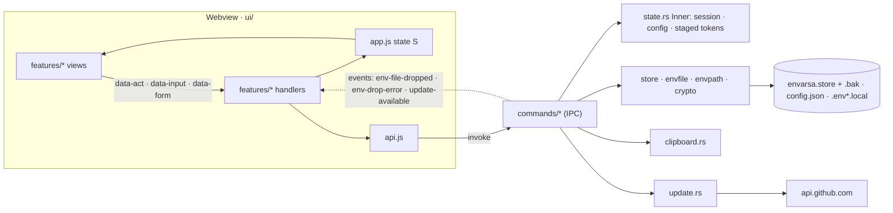

# Architecture

Envarsa is a Tauri 2 desktop app. It has two halves that ship together in one binary:

- **`ui/`**, a no-build frontend. It uses plain ES modules served as they are, and draws the window.
- **`src-tauri/`**, the Rust core. It owns the store file, the disk, the clipboard, the native dialogs and the
  network.

The webview reaches the core only through the commands registered in `src-tauri/src/main.rs`. Its capability
file (`src-tauri/capabilities/default.json`) grants nothing beyond `core:default`, so it has no filesystem,
dialog, clipboard or shell access of its own. The CSP in `tauri.conf.json` allows only the app's own scripts.

## Module map

### Rust core: `src-tauri/src/`

| File | What it owns |
|---|---|
| `main.rs` | Builds the app: plugins (single instance, dialog, opener), boot-time state, the drag-and-drop hook and the command list. It also sets the Windows title-bar colours. |
| `state.rs` | Holds the in-memory state, meaning the session (unlocked, locked or corrupt), the config, and the tokens for picked files and write targets. It also resolves the store location (`ENVARSA_STORE_PATH`, then Settings, then app data), loads `config.json` forgivingly, and seeds demo data (`ENVARSA_DEMO`, from `demo.json`). |
| `store.rs` | Defines the store file: its format, serialization, `open` (plain or age), `save` with a `.bak`, `write_atomic`, `align_backup`, and `merge_import` for imports. |
| `envfile.rs` | The `.env` line model (`Line`), which is also the editor's wire format. Covers parsing, serialization, value quoting, and the merge that writes `.env.local` and reports its changes in the same pass. |
| `envpath.rs` | Classifies a file name as writable (`.env*.local`), an example (never written) or other, and gives the refusal text for the last two. |
| `crypto.rs` | age passphrase encryption. An encrypted store is a plain age file. |
| `clipboard.rs` | Copying a secret: Windows history and cloud exclusion, retry with backoff, and clearing after 30 s. |
| `update.rs` | The opt-in update check and the only network code. It holds the three update commands and the build's running version. |
| `commands/mod.rs` | Plumbing shared by the commands: `with_store`, `mutate`, `dialog_path` and `read_text_capped`. |
| `commands/session.rs` | Status, unlock, lock, the three protection changes (through `reprotect`) and restoring a backup. |
| `commands/library.rs` | Listing, the project view with reuse badges, capture (from a paste, a picked file or a dropped file), the editor, project edits, delete, and restoring an older snapshot. |
| `commands/secrets.rs` | Reveal, and copy to the clipboard. |
| `commands/export.rs` | Exporting a snapshot or a copy of the store, and the whole `.env.local` write: staging, the write plan, preview and write. |
| `commands/transfer.rs` | Revealing and relocating the store file, and importing another store. |
| `commands/tests.rs` | Every command end to end, over a real store in a temp folder, through Tauri's mock app. |

`tests/glib_variant_str_iter.rs` proves the vendored glib security patch (`vendor/`, see `vendor/README.md`).

### Frontend: `ui/`

| File | What it owns |
|---|---|
| `index.html`, `styles.css` | The page shell and the one stylesheet. |
| `js/api.js` | One wrapper per command. This is the only file that calls `invoke`. Outside Tauri it loads `mock.js` first. |
| `js/app.js` | The state `S`, rendering, dialogs, toasts, the `run` and `busy` handler wrappers, and data loading. Features import it; it imports no feature. |
| `js/main.js` | Merges each feature's `{ modals, actions, inputs, forms }` into the dispatch tables, wires DOM and Tauri events, and boots. Nothing imports it. |
| `js/kit.js`, `js/util.js` | Shared view parts and icons, and plain text helpers. |
| `js/features/*.js` | Each feature's markup and handlers together: `library`, `capture`, `write`, `editor`, `import`, `settings`. |
| `js/mock.js` | Canned responses for opening `ui/` in a plain browser. It never activates inside the app. |

### Around them

| Path | What it is |
|---|---|
| `tools/check-contract.sh` | Checks that `api.js` and the command list match, that the mock answers every command, that emitted and handled events match, and that every `data-*` key has a handler. |
| `.github/workflows/ci.yml` | On every pull request: `cargo fmt --check`, `cargo test` and the contract script on Linux, and `cargo test` on the windows-gnu toolchain the release uses. |
| `.github/actions/setup-windows-gnu/` | The Windows toolchain setup and `WebView2Loader.dll` staging, shared by `ci.yml` and `release.yml`. |
| `.github/workflows/release.yml` | Tagged releases: the Windows installer and MSIX, plus the engine tests on Linux. |
| `tools/package-msix.ps1`, `Package.appxmanifest`, `Assets/` | Microsoft Store packaging. |
| `website/` | envarsa.dev, published by `pages.yml`. |

## From the webview to disk

A user action goes around one loop. **Action, then state, then render:**

1. Views draw HTML whose buttons, inputs and forms carry `data-act`, `data-input` or `data-form`.
2. `main.js` sends each event to the handler registered under that key.
3. The handler calls `api.js`, which invokes a command.
4. The command locks the state (`AppState::with`) and works on the unlocked store through one of two helpers.
   - `with_store` reads it.
   - `mutate` changes a copy of the store and saves it with `store::save`. Only then does it replace the live
     store, so a failed save changes nothing.
5. The handler updates `S` and re-renders.

`store::save` works in three steps:

1. Serialize the store as pretty JSON, and encrypt it with age when the store is protected.
2. Copy the current file to `envarsa.store.bak`.
3. Write the new bytes through `write_atomic` (temp file, fsync, rename).

`.env.local` writes and `config.json` also go through `write_atomic`.

**Native dialogs** run on a worker thread through `dialog_path`. Cancelling returns `None`.

**Drag and drop** is a window event, not a command. Rust reads the dropped file, stages it, and emits a
finished payload.

## Events

These go from the core to the webview. The contract script checks that every emitted event has a handler.

| Event | Emitted by | Payload |
|---|---|---|
| `env-file-dropped` | `library::handle_drop` | A picked file: `{ token, path, dir, nameGuess, text }`. `path` is for display only. |
| `env-drop-error` | `library::handle_drop` | An error message. |
| `update-available` | `update::maybe_spawn_auto_check` | The newer version, as a string. |

The UI also listens to Tauri's own `tauri://drag-enter`, `tauri://drag-leave` and `tauri://drag-drop` events to
show and hide the drop zone.

## The token-staging protocol

The webview never sends the core a filesystem path. When the user picks a file, Rust keeps the path in
`state.rs` and hands the webview an opaque token. Later commands accept only that token.

| Slot in `Inner` | Staged by | Redeemed by |
|---|---|---|
| `pending_source` | `pick_env_file`, drag and drop | `capture` (`sourceToken`), which records where the snapshot came from |
| `pending_import` | `pick_import_store` | `inspect_import`, `apply_import` |
| `pending_target` | `stage_write_target`, `pick_write_target` | `preview_write`, `write_env_local` |
| `pending_example` | `pick_example_file`, which also holds the example's text | `preview_write`, `write_env_local` |

Four rules apply to every slot:

- **One per slot.** A new pick replaces only its own slot. That keeps the write dialog's two tabs independent.
- **Must match.** A token that doesn't match its slot is refused, for example "that write is no longer staged".
- **The token decides the write.** A token from the example slot fills that example; one from the target slot
  writes the snapshot, merged into an existing file when `merge` is true. `merge` doesn't apply to examples.
- **A finished write clears both write slots.** The dialog has closed, so neither token is valid any more.

Paths do travel the other way, for display. The one path the user types is the project folder (`pathHint`),
which is plain text they own. `stage_write_target` uses it as a fallback for the default `.env.local`
location. The dialog shows the resulting path, and the name guard still applies.

## Invariants

These are the rules the code keeps. Refactors may change how one is enforced, never what it guarantees. Each
place that enforces a rule names it in a comment.

| Name | Rule | Enforced in |
|---|---|---|
| **PATHS-STAY-IN-CORE** | Nothing is read, imported or written at a path the webview supplies. Picks and drops become tokens (see above). Two paths the webview does send never select a file: `pick_write_target`'s folder only sets where the dialog opens, and the project folder is text the user typed. | `state.rs` token slots; `commands/*` |
| **VALUES-ON-REVEAL** | Listings carry keys and structure, never values. Malformed lines are masked too, since they may hold a secret. A value crosses on an explicit reveal, and into the editor when the user opens it (`edit_lines`). A copy goes from the core straight to the clipboard. | `library::get_project` (`LineView`), `secrets.rs` |
| **CLIPBOARD-CLEARS** | A copied secret stays out of Windows clipboard history and the cloud clipboard, and is cleared after 30 s. The clear happens only if it is still the latest copy and the clipboard still holds it. | `clipboard.rs` |
| **WRITES-ONLY-LOCAL** | The only file Envarsa writes into a project tree is a `.env*.local`, and only on an explicit write. It is checked on the final path, just before writing. An example file is only ever read. | `envpath.rs`, `export::guard_writable_local` |
| **ATOMIC-WRITES** | The store, `config.json` and `.env.local` are written through a temp file, fsync and rename, so a crash can't leave a torn file. The store keeps a `.bak` of its previous version. | `store::write_atomic`, `store::save` |
| **MEMORY-FOLLOWS-DISK** | The live store changes only after its save succeeds. A protection change adopts the new passphrase only after saving under it. | `commands::mutate`, `session::reprotect` |
| **BACKUP-MATCHES-PROTECTION** | After encryption is turned on, changed or turned off, the `.bak` is rewritten under the new protection, so no plaintext copy survives encrypting. | `store::align_backup` via `reprotect` |
| **ONE-EGRESS** | The update check is the only network code. It runs only when the user clicks "Check for updates", or when they have turned on the automatic check. It uses HTTPS only, follows no redirects, reads at most 256 KB, and parses the tag strictly. The automatic check runs at most once every 24 h and stamps the time before fetching, so a failing network can't cause a retry storm. It is off in Microsoft Store builds. | `update.rs` |

Two more rules support these:

- **Config tolerance.** `config.json` loads forgivingly and keeps keys this build doesn't know, so older and
  newer builds can share it.
- **Import checks.** An import rejects blank and duplicate project names before touching the library, because
  hand-edited store files are supported.

## Testing

- **`cargo test`** covers the core modules. `commands/tests.rs` drives every command the way the webview does:
  arguments are decoded from the webview's JSON, and responses are checked as the JSON it receives. Native
  dialogs are stood in for by calling the staging function each dialog command uses.
- **The clipboard test** is `#[ignore]` because it needs a desktop session. Run it with
  `cargo test -- --ignored copy`.
- **`tools/check-contract.sh`** checks that both sides stay wired.
- **The UI itself** can be clicked through in a plain browser against `mock.js`, or in the app with
  `ENVARSA_DEMO=1 npm run dev`.
