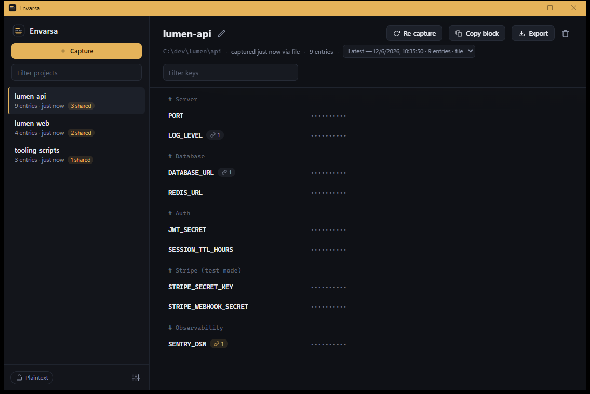

# Envarsa

A local-first store for your `.env` files. Capture a project's `.env` as a snapshot, recall values
masked, and hand them back by clipboard or export. Everything lives in one JSON file on disk — no cloud,
no telemetry, no network calls except an opt-in update check (off by default).



## Install

From the [latest release](https://github.com/terminalis/envarsa/releases/latest):

**Windows 10/11, x64**

- **Installer** (`Envarsa_x.y.z_x64-setup.exe`) — per-user NSIS, no admin; fetches WebView2 if missing.
- **Portable** (`envarsa_x.y.z_x64_portable.zip`) — unzip and run `envarsa.exe` with `WebView2Loader.dll`
  beside it. Nothing on PATH.

**Linux, x64**

- **AppImage** (`Envarsa_x.y.z_amd64.AppImage`) — `chmod +x`, run. WebKitGTK + OpenSSL bundled; needs
  glibc 2.35+ (Ubuntu 22.04+, Debian 12+).
- **Debian** (`Envarsa_x.y.z_amd64.deb`) — `sudo apt install ./Envarsa_x.y.z_amd64.deb`; pulls
  WebKitGTK 4.1 + libssl3 and adds a menu entry.

Notes:

- Windows builds need the WebView2 runtime (preinstalled on Windows 11 / current Windows 10). The portable
  build won't fetch it — install it [from Microsoft](https://developer.microsoft.com/microsoft-edge/webview2/)
  if it won't start.
- Binaries are unsigned; Windows shows a one-time SmartScreen prompt (*More info → Run anyway*).
- The store lives in `%APPDATA%\com.envarsa.app` (Linux `~/.local/share/com.envarsa.app`), not beside the
  exe. Repoint it in Settings.
- Blank window on first Linux launch: relaunch with `WEBKIT_DISABLE_DMABUF_RENDERER=1` (a WebKitGTK DMABUF
  issue on some GPU/Wayland setups).

## How it works

Envarsa stores, copies, and exports `.env` values. It never injects them into processes or writes to your
project tree unless you ask. Projects live in the store, keyed by a name you choose, not a path. Capture is
manual — it never watches your files.

1. **Capture** — import a `.env` (picker, paste, or drop); comments, blanks, and unparseable lines are kept
   byte-for-byte. Or build one in the editor.
2. **Recall** — browse keys, comments, and history. Duplicate keys are tagged `overridden`; keys shared
   across projects get a reuse badge (flagged, not linked).
3. **Hand back** — copy a value (to clipboard, never shown on screen), copy the block, or export a
   byte-identical `.env`. Copies clear after 30s.
4. **History** — every capture appends a snapshot; view past ones read-only or restore one as latest.
5. **Write `.env.local`** — write a snapshot to a `.env*.local` you pick: **merge** to fill values while
   keeping the file's comments and keys, or **fresh** to overwrite, with a preview first. From a
   `.env.example` it scaffolds a `.env.local`, blanking keys it can't fill. Only `.env*.local` is writable,
   and only with the store unlocked.
6. **Build by hand** — type keys, values, and `#` comments in the editor. Editing a snapshot saves a new
   one and keeps the old.

Masking is structural, not heuristic: every value is masked (keys always shown), revealed one at a time and
auto-hidden after 30s or on focus loss. Unparseable lines are masked too.

## The store file

One portable file, `envarsa.store`:

- **Plaintext JSON by default** (`envarsa-store` v1, snapshot text embedded verbatim) — read, diff, and
  back it up with anything.
- **Atomic writes** — temp + fsync + rename, with a one-step `.bak`. A corrupt store is never overwritten;
  the app offers the backup at startup. Toggling encryption rewrites the `.bak`, so no stale plaintext is
  left behind.
- **Optional age encryption** — scrypt passphrase; `age -d envarsa.store` decrypts with the reference CLI.
  No recovery if the passphrase is lost.
- **Manual portability** — export a copy (optionally age-encrypted) and import elsewhere; projects merge,
  name conflicts flagged per project. Or sync the file yourself.

Default path `%APPDATA%\com.envarsa.app\envarsa.store` (Linux `~/.local/share/com.envarsa.app/envarsa.store`);
override in Settings or `ENVARSA_STORE_PATH`.

## Security

The store is plaintext JSON unless you enable age encryption; masking hides values in the UI, not on disk.
Beyond that:

- The webview is sandboxed (CSP `default-src 'self'`). Values reach it only on explicit reveal, and
  single-value copies bypass it entirely. No IPC command takes a filesystem path — drops are read in Rust;
  import and write targets resolve behind opaque tokens. Only `.env*.local` is writable; `classify_name`
  (`envpath.rs`) rejects `.env.example`, `.sample`, `.template`, and `.dist`.
- Clipboard copies clear after 30s and skip Windows clipboard history (Win+V) and the cloud clipboard.
  Linux has no such flag — clear your clipboard manager manually.
- No network calls by default. The only egress is the opt-in update check (off by default): a GET to
  `api.github.com` for the latest release tag, validated as semver, with nothing auto-downloaded. It lives
  in `update.rs`.

## Build

Prereqs — **Windows:** Rust (`x86_64-pc-windows-gnu` works without Visual Studio, see note), Node, WebView2
(ships with Windows 11). **Linux:** Rust, Node, and
`sudo apt install libwebkit2gtk-4.1-dev build-essential curl wget file libxdo-dev librsvg2-dev libssl-dev`.

```
npm install
npm run dev                # tauri dev
npm run build              # Windows: exe + NSIS · Linux: AppImage + .deb
npm run package:portable   # Windows: zip the exe + WebView2Loader.dll
```

Fresh Windows clone, one-time: `tauri.windows.conf.json` bundles `target/release/WebView2Loader.dll` as a
resource, and tauri-build refuses to build — even `cargo test` — until it exists. The DLL ships in the
`webview2-com-sys` crate; the *Stage WebView2Loader.dll* step in `.github/workflows/release.yml` is the
recipe (build `-p webview2-com-sys`, copy from its `out/x64/`). Linux needs no staging.

Tests and end-to-end selftest:

```
cd src-tauri && cargo test                        # parser, store, crypto
$env:ENVARSA_SELFTEST='1'                         # drives the app through capture/reveal/
$env:ENVARSA_STORE_PATH="$env:TEMP\st.envarsa"    # copy/export/encrypt/lock/unlock/import,
.\target\debug\envarsa.exe                        # prints a report
```

(Linux: `ENVARSA_SELFTEST=1 ENVARSA_STORE_PATH=/tmp/st.envarsa ./target/debug/envarsa`)

`ENVARSA_DEMO=1` seeds sample projects into an *empty* store.

> **windows-gnu note:** rustc must keep its self-contained linker — do **not** put
> `x86_64-w64-mingw32-gcc` on PATH (a foreign GCC's CRT clashes with rustup's MinGW objects). The resource
> step needs binutils' `windres`/`dlltool`/`as` plus an *unprefixed* `gcc` for `.rc` preprocessing; a stock
> MinGW-w64 with prefixed aliases removed satisfies both. MSVC needs none of this.

## Layout

```
ui/         no-build frontend (ES modules, withGlobalTauri; mock.js = browser-preview stub)
src-tauri/  Rust core: envfile.rs (parse/serialize/merge), envpath.rs (.env*.local guard),
            store.rs (atomic persistence), crypto.rs (age), commands.rs (IPC surface),
            state.rs (session)
```

## License

MIT — see [LICENSE](LICENSE).
